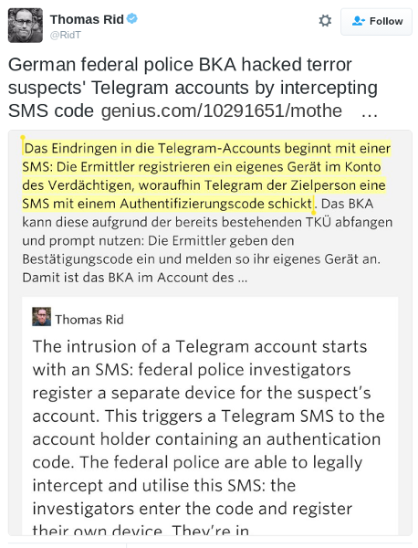
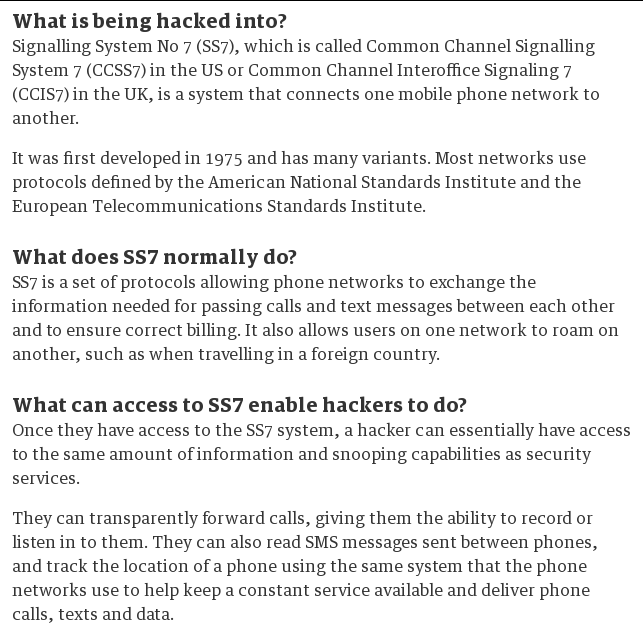
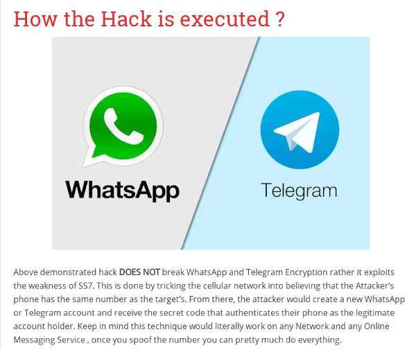
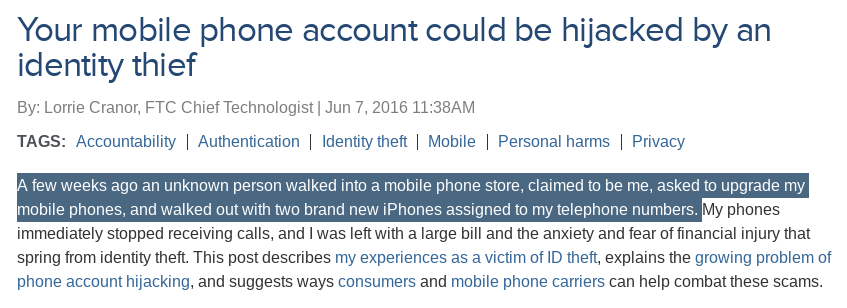
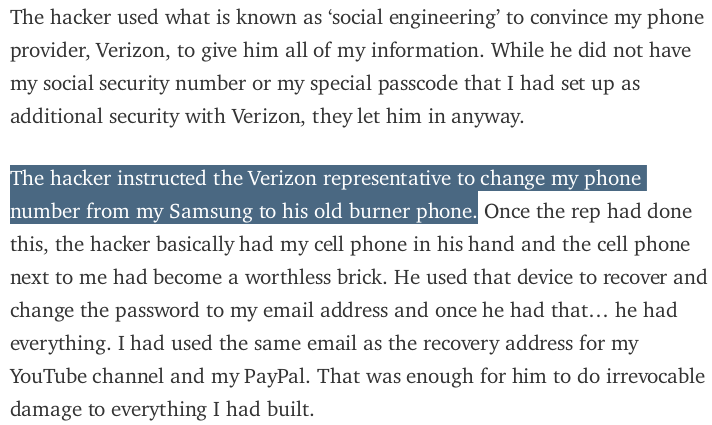
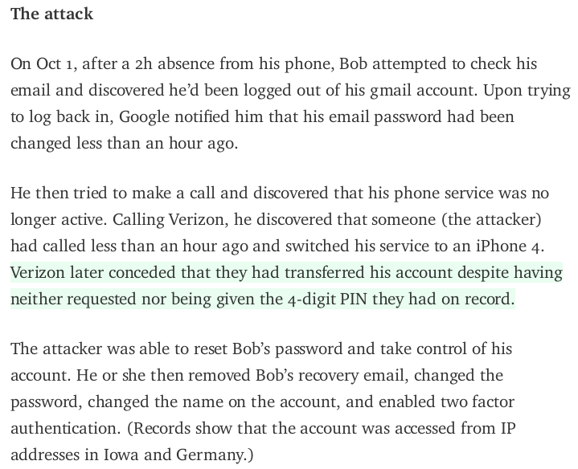
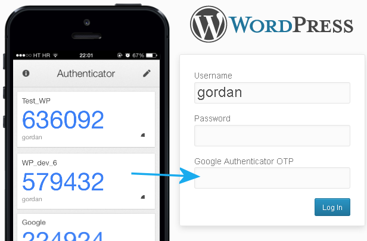
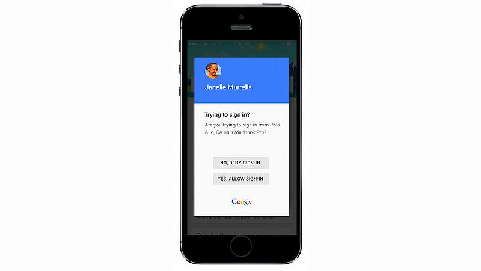
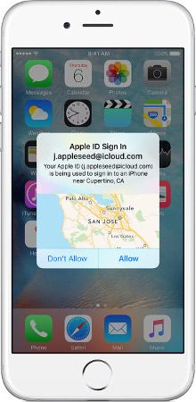

Overview
========

- Introduction

- The Problem

- Common Solutions

- What's Wrong with SMS OTP?

- Alternatives to SMS OTP

- Code Examples

- Conclusion

- Resources

Introduction
============

- Software developer
    - 17+ years professionally
    - Security software developer
    - Design and implement secure APIs

- InfoSec
    - Software vulnerability assessment
    - Auditing
    - CISSP 2005+
	- US Army

- IT Background
	- IT Admin
    - ISP (dial-up land)
    - DevOps

Introduction
============

- Founding member, Houston dc713

- Founding member, Houston Area Hackers Anonymous

- OpenBSD user

- Amateur radio enthusiast

- Electronics hobbyist

About You
=========

- Red Team

About You
=========

- Red Team

- Blue Team

About You
=========

- Red Team

- Blue Team

- Developer

About You
=========

- Red Team

- Blue Team

- Developer

- How many developers also raised your hands for red or blue teams?

The Problem
===========

- Many sites have poor security, poor password crypto

- Bad guys break in and steal both

- Users reuse user ids and passwords across sites

- Bad guys use these credentials to move from less valuable to more
  valuable sites
  
Common Solutions
================

- Password-expiry intervals

- Password complexity requirements

- Two-Factor Authentication

A Brief Overview of Two-Factor Authentication
=============================================

- Biometric

- Single-purpose devices (RSA SecurID)

- Smart-phone apps (Google Authenticator)

- Short Message Service one-time pad (SMS OTP)

Survey
======

- Who thinks SMS OTP is Secure?

Survey
======

- Who thinks SMS OTP is Secure?

- Who thinks SMS OTP is Good Enough?

Survey
======

- Who thinks SMS OTP is Secure?

- Who thinks SMS OTP is Good Enough?

- Who thinks SMS OTP is "better than nothing"?

Survey
======

- Who thinks SMS OTP is Secure?

- Who thinks SMS OTP is Good Enough?

- Who thinks SMS OTP is "better than nothing"?

**Let's see whether we can change a few opinions.**

What is SMS OTP Two Factor Authentication?
==========================================

- Sending a code, PIN or other one-time-use authentication token to a
  user’s cell phone using the short-message service.

- The token is entered **without transformation** as a second
  authentication factor.

- Similar to sending authentication token via email.

Typical Use Cases
=================

- Second factor during authentication

- Password reset OTP

SMS OTP Advantages
==================

- In 2016 nearly everyone has a phone

- Nearly real time

- Cellphones are unique to users

- Easy for users to configure and use

What's Wrong with SMS OTP?
==========================

- SMS standard does not require encryption

- SMS encryption standards have all been cracked
    - Can be decoded in real time using COTS hardware and software

- No forward secrecy

- Deprecated in current draft of NIST Special Publication 800-63-3,
  Digital Authentication Guideline
      - To be removed in future version

- Net effect: **Authentication code is sent in the clear**

- False sense of security

Defending SMS OTP
=================

- The attacks aren't easy to effect

- SMS OTP is easy for end users to use and understand

- "Our system needs good enough, not perfect"

- "Our Site doesn't have anything of value"

- "SMS OTP is better than nothing"

Lawful Intercept
================

Using SS7 to Hack GSM Network
=============================

Using SS7 to Hack WhatsApp
==========================

Intercepting GSM Transmissions
==============================

Intercepting GSM Transmissions
==============================

Identity Theft
==============

Social Engineering I
====================

Social Engineering II
=====================

Survey Revisited
================

**Who wants to change their answers?**

- Who thinks SMS OTP is Secure?

- Who thinks SMS OTP is Good Enough?

- Is SMS OTP "better than nothing"?

"We Need Good Enough, Not Perfect"
==================================

If what your protecting is important enough to need two factors of
authentication, doesn't it need a secure second factor?
\newline

Or are you cargo culting?

"Our Site doesn't have anything of value"
=========================================

Everyone is thinking about lateral movement through systems. **Who's
thinking about lateral movement through people and organizations?**
\newline

That is:
\newline

**Who can the bad guys get to by going through the people and
organizations they're connected to**?
\newline

Your site might be the first step. The users themselves may be the
value.
\newline

If you're going to do security, do it right for the scenario under
consideration.

"SMS OTP is Better than Nothing"
================================

SMS OTP is not "better than nothing".

"SMS OTP is Better than Nothing"
================================

SMS OTP is not "better than nothing".
\newline

Depending on the site and the attack, **it's worse than nothing**.

Alternatives to SMS OTP
======================

- None

- Proprietary Protocol / Write You Own

- Third-party app using secure protocol

- In-App

None
====

- Default solution for most sites

- Do you really need two-factor authentication?

- Seriously, do you need two factor?

- What problem are you trying to solve?
  
- Is it a security problem or a usability problem? Both?

None -- Pros
============

- User only has to remember login id and password

- Shared responsibility for security of account

- Great for users who don't have cell phones

None -- Cons
============

- Places onus of security on user

- Need lost-id and lost-password processes

- Can't defend against lateral movement across sites when credentials
  are compromised

- May require user to store one or more "emergency" passwords

Proprietary Protocol / Write Your Own
=====================================

- Don't!

- Stick to well-reviewed protocols with multiple, compatible
  implementations

- You wouldn't devise your own crypto algorithm ... would you?

Third-party Apps
================

**Delegate second-factor token generation to another app or service
provider like Google Authentication or Authy.**

Third-party Apps -- Pros
========================

- User may already have app installed

- Main contenders (Google Authenticator and Authy) standards based

- Authy can syncrhonize shared secrets across devices and has a
  desktop app

- Doesn't require developing a custom app just for two factor

- CLI tools (for the geeks)

Third-party Apps -- Cons
========================

- Often requires per-site shared secrets

- Not as easy as sending a text message

- Losing shared secret can lead to lockout

- May require user to store one or more "emergency" passwords

- Replacing shared secrets is even harder (more steps) than
  changing a password

In-App -- Google Two Step
=========================

> 

In-App -- Apple ID Sign In
==========================

> 

In-App -- Pros
==============

- Secure-able

- Good option for sites whose users typically or must install the
  app (banks)
  
- Easy for users to use and understand

In-App -- Cons
==============

- Requires user to install a unique app per site

- Not as easy as sending a text message

- Deleting app or lost phone can lead to lock out

- May require user to store one or more "emergency" passwords

- Need a re-keying strategy for shared secret

In-App Solutions
================

- Authorization Request / Approve (Apple and Google style)

- Counter based: HOTP - RFC 4226

- Time based: TOTP - RFC 6238

HOTP Up Close
==========================

*[A]n algorithm to generate one-time password values, based on Hashed
Message Authentication Code (HMAC). - RFC 4226*

> 

- Easy to implement, libraries for most languages (see Resources)

- Uses keyed-hash message authentication codes where the message to be
  hashed is a non-repeating counter

- Output is 6 or 8 digits

TOTP Up Close
=============

*[A]n extension of the One-Time Password (OTP) algorithm, namely the
HMAC-based One-Time Password (HOTP) algorithm, as defined in RFC
4226, to support the time-based moving factor. - RFC 6238*

- HOTP using timestamps as the message to be hashed

- Easy to implement, libraries for most languages (see Resources)

Python -- Time Based
====================

~~~~~~~
import pyotp

totp = pyotp.TOTP('base32secret3232')
totp.now() # => 492039

# OTP verified for current time
totp.verify(492039) # => True
time.sleep(30)
totp.verify(492039) # => False

# HOTP example similar
# See examples in pyotp
~~~~~~~

Python -- Using Google Authenticator Secret Key
===============================================

~~~~~~~
import pyotp

totp = pyotp.TOTP("JBSWY3DPEHPK3PXP")
print("Current OTP:", totp.now())
~~~~~~~

Conclusion
==========

- SMS OTP is **NOT** Secure Two-Factor Authentication

- Sites should consider whether they need two-factor

- Two-factor authentication can be done via cell phone

- Third-party apps using secure protocols are available

- Secure protocols for in-app two-factor authentication exist

- Libaries for secure two-factor authentication are plentiful and easy
  to use

Questions
=========

- Contact:
	- Twitter: @akpoff
	- Email: akp@hypernote.com
	- Blog: http://akpoff.com/
	- Github: https://github.com/akpoff/

Resources
=========

- Very select and incomplete list of resources
- Google is your friend
- InfoSec people are your friends

Short Message Service Specification
===================================

- [Specification](https://portal.3gpp.org/desktopmodules/Specifications/SpecificationDetails.aspx?specificationId=747)
- [A5/1 Stream Cipher (54-bit)](https://en.wikipedia.org/wiki/A5/1)
- [A5/2 Stream Cipher (the weaker version of A5/2)](https://en.wikipedia.org/wiki/A5/2)
- [A5/3 "Kasumi" block cipher (better but not great)](https://en.wikipedia.org/wiki/KASUMI)

Intercepting SMS Messages
=========================

- [Lawful intercept](http://genius.it/motherboard.vice.com/de/read/exklusiv-wie-das-bka-telegram-accounts-von-terrorverdaechtigen-knackt)
    - [Thomas Rid's Summary Tweet](https://twitter.com/RidT/status/769234433895522308)
- [Hacking WhatsApp using SS7 - Live Demo](https://www.youtube.com/watch?v=qPPWQbGTptQ)
	- [Guardian article explaining SS7 hack](https://www.theguardian.com/technology/2016/apr/19/ss7-hack-explained-mobile-phone-vulnerability-snooping-texts-calls)
    - [Explaination of the live demo the SS7 hack](http://blog.drhack.net/whatsapp-telegram-hacking-demo-live-ss7-vulnerability/)
- [Rogue Cellular Infrastructure Disguised as Office Printer](https://julianoliver.com/output/stealth-cell-tower)
- [New Attack Allows Intercepting or Blocking of Every LTE Phone Call And Text](http://www.theregister.co.uk/2016/10/23/every_lte_call_text_can_be_intercepted_blacked_out_hacker_finds/)
  - [Slides from Ruxcon presentation](http://www.slideshare.net/slideshow/embed_code/key/Ez63bGDQrP6EPY)

Social Engineering and Identity Theft
=====================================

- [Your mobile phone account could be hijacked by an identity thief](https://www.ftc.gov/news-events/blogs/techftc/2016/06/your-mobile-phone-account-could-be-hijacked-identity-thief)
- [Getting Hacked As An Internet Creator](https://medium.com/internet-creators-guild/getting-hacked-as-an-internet-creator-982d03637e86)
- [Adding a phone number to your Google account can make it LESS secure](https://tech.vijayp.ca/adding-a-phone-number-to-your-google-account-can-make-it-less-secure-f1cc7280ff6a)

RFCs and Standards
==================

- [Draft Special Publication 800-63-3: Digital Authentication Guideline](http://nstic.blogs.govdelivery.com/2016/05/08/announcing-draft-special-publication-800-63-3-digital-authentication-guideline/)
- [RFC 2104 - HMAC](https://tools.ietf.org/html/rfc2104)
- [RFC 4226 - HOTP](https://tools.ietf.org/html/rfc4226)
- [RFC 6238 - TOTP](https://tools.ietf.org/html/rfc6238)
- [Wikipedia Explanation of HMAC](https://en.wikipedia.org/wiki/Hash-based_message_authentication_code)
- [Wikipedia Explanation of HOTP](https://en.wikipedia.org/wiki/HMAC-based_One-time_Password_Algorithm)
- [Wikipedia Explanation of TOTP](https://en.wikipedia.org/wiki/Time-based_One-time_Password_Algorithm)

TOTP/HOTP Clients
=================

- [Authy](https://www.authy.com/)
- [Google Authenticator](https://github.com/google/google-authenticator)
- [oathgen - A command line HOTP and TOTP client](https://github.com/w8rbt/oathgen)
- [OATH Toolkit](http://www.nongnu.org/oath-toolkit/)

TOTP/HOTP Libraries
===================

- [C/C++ - Google Authenticator](https://github.com/google/google-authenticator)
- [C/C++ - OpenOTP](https://sourceforge.net/projects/rcdevs-openotp/)
- [C\# - OATH.NET](https://github.com/jennings/OATH.Net)
- [C\# - OTP](https://github.com/kappa7194/otp)
- [Haskell - One Time Password](https://hackage.haskell.org/package/one-time-password)
- [Java - libotp](https://github.com/kamranzafar/libotp)
- [Java - oath](https://github.com/johnnymongiat/oath)
- [Javascript - JS-OTP](https://github.com/jiangts/JS-OTP)

TOTP/HOTP Libraries (cont.)
===========================

- [Node.js - speakeasy](https://github.com/speakeasyjs/speakeasy)
- [Perl - Authen::OATH](http://search.cpan.org/dist/Authen-OATH/lib/Authen/OATH.pm)
- [Python - pyotp](https://github.com/pyotp/pyotp)
- [Python - oath](https://pypi.python.org/pypi/oath)
- [php - otphp](https://github.com/lelag/otphp)
- [php - Otis](https://github.com/eloquent/otis)
- [Ruby - rotp](https://github.com/mdp/rotp)

